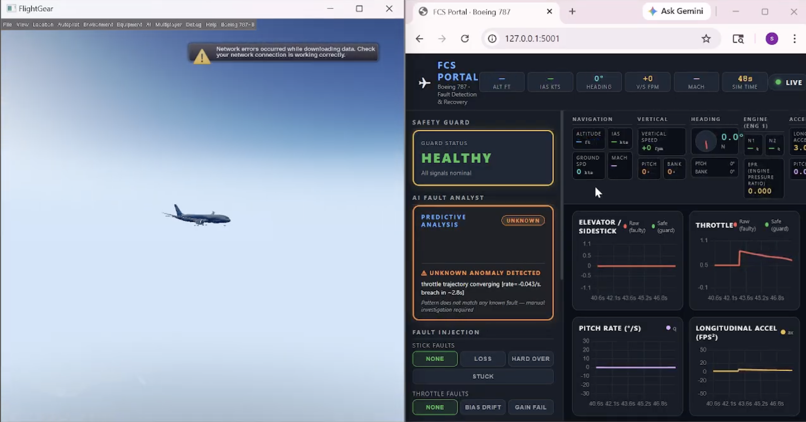
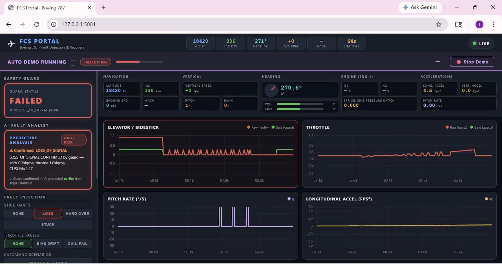

<div align="center">

# Fault-Tolerant Flight Control System

### Real-Time Sensor Fault Detection, Prediction and Recovery for Fly-By-Wire Aircraft

<br/>


</div>

---

## About

This project implements a Fault-Tolerant Flight Control System (FTCS) for Fly-By-Wire aircraft using the FlightGear flight simulator.

The system continuously monitors pilot control inputs such as side-stick and throttle commands, detects sensor faults in real time, predicts abnormal behavior using Kalman Filter and CUSUM-based analysis, and automatically replaces corrupted control signals with safe commands to maintain aircraft controllability.

A real-time dashboard provides fault visualization, system health monitoring, AI-assisted fault analysis, cascading fault simulation, and automatic fault demonstration capabilities.

---

## Key Features

### Real-Time Flight Control Monitoring

* Continuous monitoring of side-stick and throttle inputs
* Real-time telemetry streaming from FlightGear
* Live flight parameter visualization

### Advanced Fault Detection

* Kalman Filter based anomaly detection
* Innovation residual analysis
* Statistical fault classification
* Early fault prediction before guard activation

### Drift Detection

* CUSUM-based drift monitoring
* Progressive sensor degradation detection
* Long-term anomaly tracking

### Fault Classification

The system automatically identifies and classifies:

#### Side-Stick Faults

* Hard Over
* Loss of Signal
* Stuck-At Fault

#### Throttle Faults

* Gain Failure
* Bias Drift

#### Unknown Fault Detection

* Unrecognized anomaly identification
* Multi-channel fault detection
* Sensor instability detection

### Fault-Tolerant Recovery

* Automatic signal correction
* Safe command generation
* Baseline signal restoration
* Flight control continuity during failures

### Cascading Fault Simulation

* Throttle Runaway Scenario
* Control Failure Scenario
* Sensor Degradation Chain
* Multi-stage fault propagation analysis

### AI-Assisted Analysis

* Fault prediction engine
* Risk assessment
* Fault confidence estimation
* Trajectory-based anomaly forecasting

### Demonstration Mode

* Automated fault injection cycles
* Hands-free project demonstration
* Continuous fault-recovery showcase

### Interactive Dashboard

* Live telemetry visualization
* Real-time fault indicators
* Flight control status monitoring
* Fault injection controls
* System health display

---

## Screenshots

### Dashboard

<p align="center">
  
</p>

### Fault Injection Panel

<p align="center">
  
</p>


---

## Tech Stack

| Component               | Technology                      |
| ----------------------- | ------------------------------- |
| Programming Language    | Python                          |
| Flight Simulator        | FlightGear                      |
| Backend Framework       | Flask                           |
| Real-Time Communication | Flask-SocketIO                  |
| Simulator Interface     | TCP/Telnet Socket Communication |
| Fault Detection         | Kalman Filter                   |
| Drift Detection         | CUSUM Algorithm                 |
| Dashboard               | HTML, CSS, JavaScript           |
| Concurrency             | Python Threading                |
| Networking              | TCP Sockets                     |

---

## Implemented Fault Scenarios

| Fault Type         | Description                                |
| ------------------ | ------------------------------------------ |
| Hard Over          | Control surface locked at extreme position |
| Loss of Signal     | Sensor output completely lost              |
| Stuck At           | Sensor frozen at previous value            |
| Gain Failure       | Sensor scaling error                       |
| Bias Drift         | Gradual calibration drift                  |
| Throttle Runaway   | Cascading throttle fault scenario          |
| Control Failure    | Multi-channel control degradation          |
| Sensor Degradation | Progressive cascading sensor failure       |

---

## Project Structure

```text
fault-tolerant-flight-control/
│
├── main.py
├── ai_analyst.py
├── sensor_guard.py
├── fault_injector.py
├── cascading_faults.py
├── auto_demo.py
├── fg_bridge.py
├── server.py
│
├── templates/
│   └── dashboard.html
│
├── screenshots/
│
├── requirements.txt
└── README.md
```

---

## Getting Started

### Prerequisites

* Python 3.10+
* FlightGear Simulator
* Git

### Clone Repository

```bash
git clone https://github.com/SagarishaR/fault-tolerant-flight-control.git

cd fault-tolerant-flight-control
```

### Install Dependencies

```bash
pip install -r requirements.txt
```

### Start FlightGear

Configure FlightGear with Telnet enabled:

```bash
--telnet=5401
```

### Run Application

```bash
python main.py
```

### Open Dashboard

```text
http://localhost:5001
```
---

## Applications

* Fly-By-Wire Systems
* Aerospace Fault Detection
* Flight Control Research
* Safety-Critical Systems
* Aircraft Sensor Monitoring
* Autonomous Flight Systems
* Fault-Tolerant Computing
* Control Systems Engineering

---
## Future Work

- Integration with Hardware-in-the-Loop (HIL) flight control platforms.
- Development of AI-driven fault prediction using deep learning techniques.
- Extension to multi-sensor and multi-actuator fault diagnosis.
- Real-time adaptive control reconfiguration during critical failures.
- Validation under complex flight conditions and extreme operating environments.

---
## License

This project is licensed under the MIT License.
